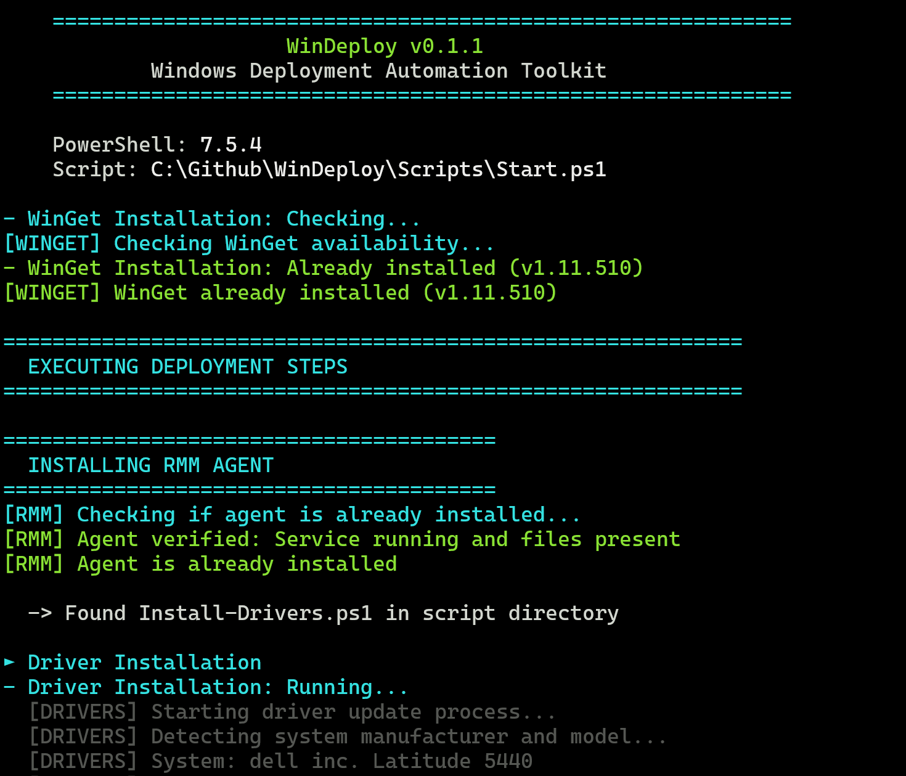
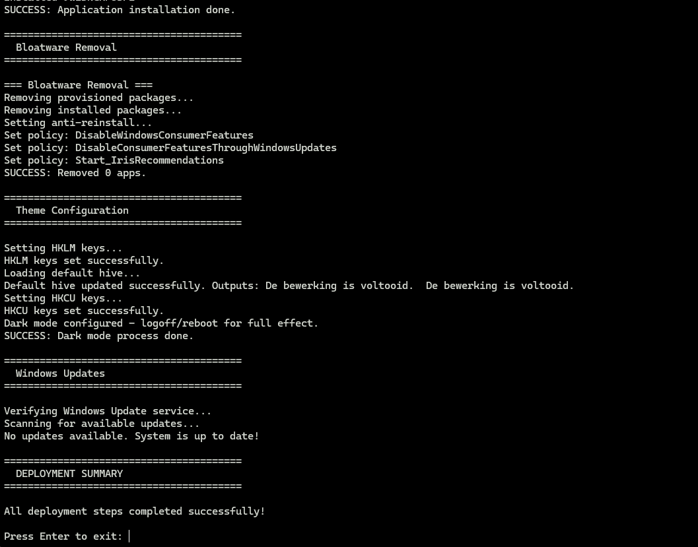
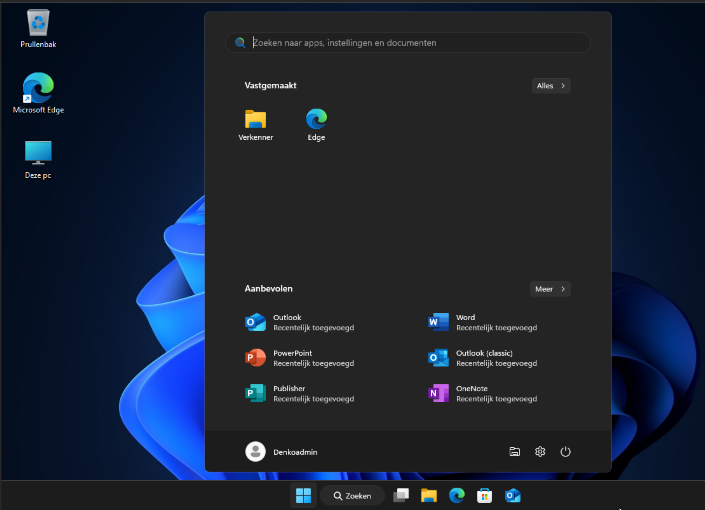
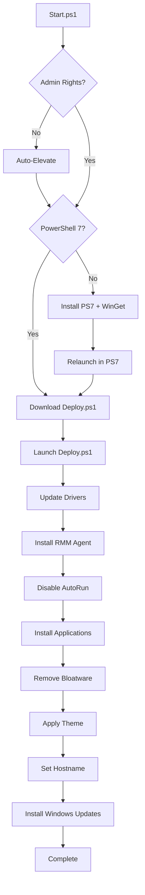
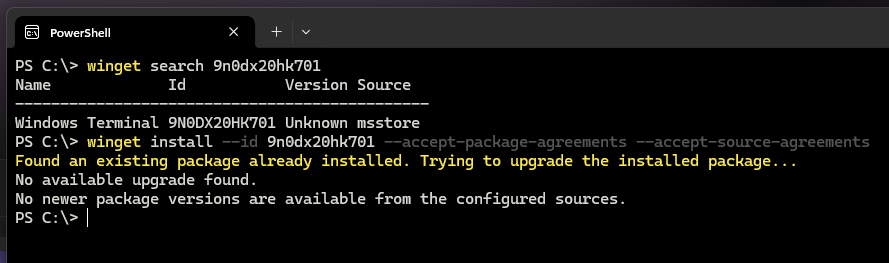

# WinDeploy - Windows Deployment Automation

**Open-source Windows 11 deployment automation toolkit built with PowerShell 7**

[](https://opensource.org/licenses/MIT)
[](https://github.com/PowerShell/PowerShell)
[](https://www.microsoft.com/windows)

Zero-touch Windows deployment with automatic driver updates, application installation, bloatware removal, and system configuration. Deploy via USB, network, RMM agents, or AutoUnattend.xml.








---

## Quick Start

**Prerequisites:** Windows 11 Pro 24H2+, PowerShell 7, internet connection

### Option 1: USB Deployment (Fresh installs)
```powershell
# 1. Create bootable Windows 11 USB
# 2. Copy autounattend.xml to USB root
# 3. (Optional) Copy RMM agent as Agent.exe to USB root
# 4. Boot from USB with network connected
# 5. Wait - everything happens automatically
```

### Option 2: Direct Execution (Existing or fresh installs)
```powershell
# Run as Administrator in PowerShell 7
iex (irm "https://raw.githubusercontent.com/Stensel8/WinDeploy/$((irm https://api.github.com/repos/Stensel8/WinDeploy/releases/latest).tag_name)/Scripts/Start.ps1")
```
```

### Option 3: Fastest method (one-liner)
```powershell
# Run as Administrator in PowerShell 7
iex(irm windeploy.stensel.nl)
```

---

## Project Structure

- [AUTO] **Auto-run during deployment** - Executed automatically by `Start.ps1`
- [DOCS] **Documentation files** - Guides and references
- [ARCHIVED] **Archived scripts** - No longer used in deployment

---

## How It Works



Start.ps1 is the main entry point that ensures the system has PowerShell 7 and WinGet installed, handles elevation, and downloads/launchs Deploy.ps1. Deploy.ps1 orchestrates the actual deployment by downloading and executing each script in sequence.


## Configuration

### Customize Application List
Edit `Scripts/Deployment/Install-Applications.ps1` (lines 20-30):
```powershell
$Applications = @(
    "Microsoft.VCRedist.2015+.x64",
    "Microsoft.Office",
    "Microsoft.Teams",
    # Add your apps here
)
```

### Customize Bloatware List
Edit `Scripts/Deployment/Remove-Bloat.ps1` (lines 15-40):
```powershell
$BloatwareList = @(
    "Microsoft.BingNews",
    "Microsoft.GamingApp",
    # Add packages to remove
)
```

### Configure RMM Agent Installation
The deployment includes automatic RMM agent installation for Datto RMM. It first checks if Datto RMM is already installed and running. If not:

- Scans all USB drives for files matching `*agent*.exe` (case-insensitive) and installs the first match silently.
- As a fallback, downloads the agent using a configurable Site ID from Datto's servers.

To configure the Site ID:
1. Edit `Scripts/Deployment/Install-RMMAgent.ps1` (line ~18).
2. Replace `"EnterYourIDHere"` with your actual Datto RMM Site ID.

**Security Note**: Do not include random or example Site IDs in the public repository to avoid accidental exposure of sensitive information. Always configure your Site ID manually after cloning the repository. Keep the ID private.

### Supported Devices (Drivers & Firmware)
- **Dell**: Latitude, OptiPlex, Precision, XPS series
- **HP**: EliteBook, ProBook, EliteDesk, ProDesk, ZBook series

To view all models, check [Supported Dell devices](Docs/SupportedDellDevices.json) or [Supported HP devices](Docs/SupportedHPDevices.json).

---

## Logging

All operations are logged:
- **Main log**: `C:\WinDeploy\Logs\Start.log`
- **Individual scripts**: `C:\WinDeploy\Logs\*.log` (e.g., Install-Drivers.log)

View logs in real-time:
```powershell
Get-Content "C:\WinDeploy\Logs\Start.log" -Wait -Tail 20
```

---

## Dependencies

WinDeploy automatically installs and manages the following dependencies:

### PowerShell Gallery (Auto-installed)
- **[winget-install](https://www.powershellgallery.com/packages/winget-install)** (v5.2.1+) - PowerShell script for reliable WinGet installation by [asheroto](https://github.com/asheroto/winget-install)
- **[PSWindowsUpdate](https://www.powershellgallery.com/packages/PSWindowsUpdate)** (v2.2.1.5+) - PowerShell module for Windows Update automation

### Application Dependencies (Auto-installed via WinGet)
- **Windows Package Manager (WinGet)** (v1.12.350+) - Installed via `winget-install` script
- **Dell Command Update** (v5.5.0+) - Auto-installed for supported Dell devices
- **HP Image Assistant** (v5.3.2+) - Auto-installed for supported HP devices

**Note:** All dependencies are automatically detected and installed during deployment. No manual installation required.

---

## Troubleshooting

### Common Issues

**Script won't run due to execution policy error**
```powershell
Set-ExecutionPolicy Bypass  # Allows the script to run for the current session
```

**Windows Spotlight not working after deployment**
If Windows Spotlight is disabled after running the deployment, run the `Fix-Spotlight.ps1` script to re-enable it:
```powershell
# Run as Administrator
& "C:\WinDeploy\Download\Fix-Spotlight.ps1"
```
This script sets the necessary registry keys and restarts Explorer. Then, set the lock screen background to "Windows Spotlight" in Settings > Personalization > Lock screen.

**WinGet not found**

Install WinGet using the winget-install script from PowerShell Gallery (by AsherToto)
Open PowerShell as Administrator and run:
```powershell
Install-Script winget-install -Force
```
Follow the prompts to complete the installation (tap A to accept all or Y individually).
Note: -Force is optional but recommended to update if outdated.

Usage:
```powershell
winget-install
```
If WinGet is already installed, use -Force to run anyway.
The script is published on PowerShell Gallery under winget-install.

**Drivers not installing**
- Check if your device is supported: See [Docs/SupportedDellDevices.json](Docs/SupportedDellDevices.json) or [Docs/SupportedHPDevices.json](Docs/SupportedHPDevices.json).
- Ensure you have an internet connection.
- Review the logs: `C:\WinDeploy\Logs\Install-Drivers.log`.

**Applications failing to install**
- Confirm WinGet is working: Run `winget --version`.
- Verify app IDs: Use `winget search <app-name>` to find the correct ID.
- Check the logs: `C:\WinDeploy\Logs\Install-Applications.log`.

Sometimes, app installations fail because WinGet has issues with certain packages. Many apps have both a standard version and a Microsoft Store (msstore) version. If the default ID doesn't work, try the msstore version.

To find the msstore App ID:
1. Run `winget search <app-name>` in PowerShell.
2. Look for entries where the "Source" column shows "Microsoft Store".
3. Or, go to [apps.microsoft.com](https://apps.microsoft.com), search for the app, and copy the App ID from the URL.

For examples, see the images below:





## Credits & Acknowledgments

### Built With
- [PowerShell](https://github.com/PowerShell/PowerShell) - Microsoft's scripting language
- [WinGet](https://github.com/microsoft/winget-cli) - Windows Package Manager
- [PSWindowsUpdate](https://www.powershellgallery.com/packages/PSWindowsUpdate) - Windows Update automation module
- [winget-install](https://www.powershellgallery.com/packages/winget-install) - WinGet installation script by [asheroto](https://github.com/asheroto/winget-install)
- [Dell Command Update](https://www.dell.com/support/kbdoc/en-us/000177325/dell-command-update) - Dell driver management
- [HP Image Assistant](https://ftp.hp.com/pub/caps-softpaq/cmit/HPIA.html) - HP driver management
- [HP CMSL](https://developers.hp.com/hp-client-management/doc/client-management-script-library) - HP Client Management Script Library
## Support & Contributing

We welcome contributions! See [CONTRIBUTING.md](CONTRIBUTING.md) for guidelines.

- **Issues**: [GitHub Issues](https://github.com/Stensel8/WinDeploy/issues)
- **Discussions**: [GitHub Discussions](https://github.com/Stensel8/WinDeploy/discussions)
- **Pull Requests**: Always welcome!


## Disclaimer

This software is provided "as is" without warranty of any kind. Always test deployments in a safe environment before production use. The authors are not responsible for any damage or data loss.

---
