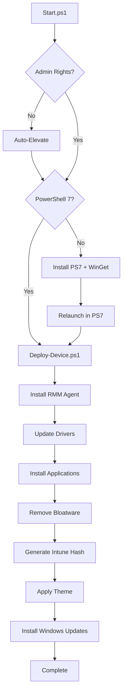

# WinDeploy - Windows Deployment Automation

**Open-source Windows 11 deployment automation toolkit built with PowerShell 7**

[](https://opensource.org/licenses/MIT)
[](https://github.com/PowerShell/PowerShell)
[](https://www.microsoft.com/windows)

Zero-touch Windows deployment with automatic driver updates, application installation, bloatware removal, and system configuration. Deploy via USB, network, RMM agents, or AutoUnattend.xml.


---

## Quick Start

**Prerequisites:** Windows 11 Pro 24H2+, PowerShell 7, internet connection

### Option 1: USB Deployment (Fresh installs)
```powershell
# 1. Create bootable Windows 11 USB
# 2. Copy autounattend.xml to USB root
# 3. (Optional) Copy RMM agent as Agent.exe to USB root
# 4. Boot from USB with network connected
# 5. Wait - everything happens automatically
```

### Option 2: Direct Execution (Existing or fresh installs)
```powershell
# Run as Administrator in PowerShell 7
iex "& { $(irm 'https://raw.githubusercontent.com/Stensel8/WinDeploy/main/Scripts/Start.ps1') }"
```

---

## Project Structure

```
WinDeploy/
├── Scripts/
│   ├── Start.ps1                         # [AUTO] Main entry point with Auto-Elevate
│   ├── Deploy-Device.ps1                 # [AUTO] Full deployment orchestrator
│   │
│   ├── Install-Drivers.ps1               # [AUTO] Dell/HP driver automation
│   ├── Install-Applications.ps1          # [AUTO] WinGet app installer
│   ├── Install-WindowsUpdates.ps1        # [AUTO] Windows Update automation
│   ├── Remove-Bloat.ps1                  # [AUTO] Bloatware removal
│   ├── Get-IntuneHash.ps1                # [AUTO] Generates Autopilot device hash for Intune
│   ├── Set-Theme.ps1                     # [AUTO] Desktop theme configuration
│   ├── Install-PowerShell7.ps1           # [AUTO] PowerShell 7 installation (if needed)
│   ├── Install-Winget.ps1                # [AUTO] WinGet installation (if needed)
│   │
│   ├── Disable-AutoRun.ps1               # [UTIL] Standalone utility (manual use)
│   ├── DisableFirstLogonAnimation.ps1    # [UTIL] Standalone utility (manual use)
│   ├── Export-Drivers.ps1                # [UTIL] Standalone utility (manual use)
│   ├── Generate-Hostname.ps1             # [UTIL] Standalone utility (manual use)
│   ├── Get-InstalledSoftware.ps1         # [UTIL] Standalone utility (manual use)
│   ├── Import-Drivers.ps1                # [UTIL] Standalone utility (manual use)
│   ├── Install-MSI.ps1                   # [UTIL] Standalone utility (manual use)
│   ├── OOBE-Requirement.ps1              # [UTIL] Standalone utility (manual use)
│   ├── Update-AllApps.ps1                # [UTIL] Standalone utility (manual use)
│   │
│   └── Utilities/                        # Shared PowerShell module files (*.psm1)
│       ├── Logging.psm1                  # Logging framework
│       ├── WinGet.psm1                   # WinGet wrapper functions
│       ├── System.psm1                   # System utilities
│       ├── Download.psm1                 # Download helpers
│       ├── Deployment.psm1               # Deployment orchestration helpers
│       ├── Driver.psm1                   # Driver detection & installation
│       ├── Network.psm1                  # Network connectivity checks
│       ├── Registry.psm1                 # Registry manipulation utilities
│       ├── RMMAgent.psm1                 # RMM agent installation
│       └── ScriptBootstrap.psm1          # Script initialization & setup (integrity checks)
│
├── Docs/
│   ├── SupportedDellDevices.json         # Dell device compatibility list
│   └── SupportedHPDevices.json           # HP device compatibility list
│
├── autounattend.xml                      # [AUTO] Unattended Windows installation config (this will only ask the user to select their drive, the setup will handle the rest on its own)
├── README.md                             # Main documentation
├── CONTRIBUTING.md                       # Contribution guidelines
├── CHANGELOG.md                          # Version history
├── LICENSE                               # MIT License
└── VERSION                               # Current version
```

**Legend:**
- [AUTO] **Auto-run during deployment** - Executed automatically by `Deploy-Device.ps1`
- [UTIL] **Standalone utilities** - Available for manual execution as needed

---

## How It Works

### Deployment Flow



## Configuration

### Customize Application List
Edit `Scripts/Install-Applications.ps1` (lines 80-100):
```powershell
$applications = @(
    @{ Id = "Microsoft.VisualStudioCode"; Name = "VS Code" },
    @{ Id = "Google.Chrome"; Name = "Chrome" },
    # Add your apps here
)
```

### Customize Bloatware List
Edit `Scripts/Remove-Bloat.ps1` (lines 50-75):
```powershell
$bloatwareList = @(
    "Microsoft.BingNews",
    "Microsoft.GamingApp",
    # Add packages to remove
)
```

### Supported Devices (Drivers)
- **Dell**: Latitude, OptiPlex, Precision, XPS series
- **HP**: EliteBook, ProBook, EliteDesk, ProDesk, ZBook series

To view all models, check [Supported Dell devices](Docs/SupportedDellDevices.json) or [Supported HP devices](Docs/SupportedHPDevices.json).

---

## Logging

All operations are logged with timestamps:
- **Main log**: `C:\WinDeploy\Logs\Deploy-Device.log`
- **Individual scripts**: `C:\WinDeploy\Logs\Install-*.log`
- **Bootstrap log**: `C:\WinDeploy\Logs\Start-Bootstrap.log`

View logs in real-time:
```powershell
Get-Content "C:\WinDeploy\Logs\Deploy-Device.log" -Wait -Tail 20
```

---
### Used Dependencies
- **WinGet**: v1.11.510 or later (auto-installed if missing)
- **PSWindowsUpdate**: 2.2.1.5 or later (auto-installed for Windows Updates)
- **Dell Command Update**: 5.5.0 or later (auto-installed for Dell devices)
- **HP Image Assistant**: 5.3.2 or later (auto-installed for HP devices)

---

## Troubleshooting

### Common Issues...

**Script won't run - execution policy error**
```powershell
Set-ExecutionPolicy Bypass # This will allow the script to run for this session
```

**WinGet not found**
```powershell
# Run Install-Winget.ps1 first
.\Scripts\Install-Winget.ps1
```

**Drivers not installing**
- Check device compatibility in [Docs/SupportedDellDevices.json](Docs/SupportedDellDevices.json) or [Docs/SupportedHPDevices.json](Docs/SupportedHPDevices.json)  
- Verify internet connection
- Check logs: `C:\WinDeploy\Logs\Install-Drivers.log`

**Applications failing to install**
- Verify WinGet is functional: `winget --version`
- Check app IDs: `winget search <app-name>`
- Review logs: `C:\WinDeploy\Logs\Install-Applications.log`


## Credits & Acknowledgments

### Built With
- [PowerShell](https://github.com/PowerShell/PowerShell) - Microsoft's task automation framework
- [WinGet](https://github.com/microsoft/winget-cli) - Windows Package Manager
- [PSWindowsUpdate](https://www.powershellgallery.com/packages/PSWindowsUpdate) - Windows Update automation module
- [Dell Command Update](https://www.dell.com/support/contents/en-us/article/product-support/self-support-knowledgebase/software-and-downloads/dell-command-update) - Dell driver management
- [HP Image Assistant](https://ftp.hp.com/pub/caps-softpaq/cmit/HPIA.html) - HP driver management

---

## Support & Community

- **Issues**: [GitHub Issues](https://github.com/Stensel8/WinDeploy/issues)
- **Discussions**: [GitHub Discussions](https://github.com/Stensel8/WinDeploy/discussions)
- **Pull Requests**: Always welcome!

---

## Contributing

We welcome contributions! See [CONTRIBUTING.md](CONTRIBUTING.md) for guidelines.


## Disclaimer

This software is provided "as is" without warranty of any kind. Always test deployments in a safe environment before production use. The authors are not responsible for any damage or data loss.

---
