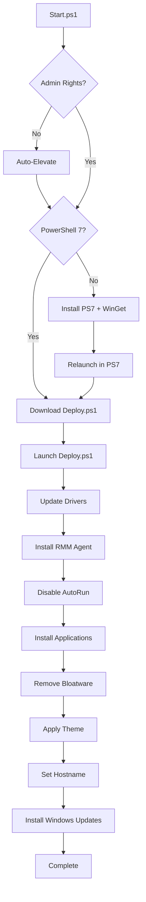

# WinDeploy - Windows Deployment Automation

**Open-source Windows 11 deployment automation toolkit built with PowerShell 7**

[](https://opensource.org/licenses/MIT)
[](https://github.com/PowerShell/PowerShell)
[](https://www.microsoft.com/windows)

Zero-touch Windows deployment with automatic driver updates, application installation, bloatware removal, and system configuration. Deploy via USB, network, RMM agents, or AutoUnattend.xml.


---

## Quick Start

**Prerequisites:** Windows 11 Pro 24H2+, PowerShell 7, internet connection

### Option 1: USB Deployment (Fresh installs)
```powershell
# 1. Create bootable Windows 11 USB
# 2. Copy autounattend.xml to USB root
# 3. (Optional) Copy RMM agent as Agent.exe to USB root
# 4. Boot from USB with network connected
# 5. Wait - everything happens automatically
```

### Option 2: Direct Execution (Existing or fresh installs)
```powershell
# Run as Administrator in PowerShell 7
iex "& { $(irm 'https://raw.githubusercontent.com/Stensel8/WinDeploy/main/Scripts/Start.ps1') }"
```

### Option 3: Fastest method (one-liner)
```powershell
iex(irm windeploy.stensel.nl)
```

---

## Project Structure

```
WinDeploy/
├── Scripts/
│   ├── Start.ps1                         # [AUTO] Main entry point with Auto-Elevate
│   ├── Deploy.ps1                        # [AUTO] Deployment orchestrator (downloaded and launched by Start.ps1)
│   ├── autounattend.xml                  # [AUTO] Unattended Windows installation config
│   │
│   ├── Archived/
│   │   ├── Get-InstalledSoftware.ps1     # [ARCHIVED] Lists installed software
│   │   └── Get-IntuneHash.ps1            # [ARCHIVED] Generates Autopilot device hash for Intune
│   │
│   ├── Deployment/
│   │   ├── Disable-AutoRun.ps1           # [AUTO] Disables AutoRun for security
│   │   ├── Install-Applications.ps1      # [AUTO] WinGet app installer
│   │   ├── Install-Drivers.ps1           # [AUTO] Dell/HP driver automation
│   │   ├── Install-RMMAgent.ps1          # [AUTO] RMM agent installation
│   │   ├── Install-WindowsUpdates.ps1    # [AUTO] Windows Update automation
│   │   ├── Remove-Bloat.ps1              # [AUTO] Bloatware removal
│   │   ├── Set-HostName.ps1              # [AUTO] Hostname configuration
│   │   ├── Set-Theme.ps1                 # [AUTO] Desktop theme configuration
│   │   └── README.md                     # Deployment scripts documentation
│   │
│   └── Intune/
│       └── Company branding/
│           └── Platform scripts/
│               ├── Install-DattoRMM-Intune.ps1
│               └── Skip-OOBEPrivacy-Intune.ps1
│
├── Docs/
│   ├── Intune-Autopilot-Setup.md         # Intune Autopilot setup guide
│   ├── SupportedDellDevices.json         # Dell device compatibility list
│   ├── SupportedHPDevices.json           # HP device compatibility list
│   └── Intune configuration/
│       └── intune-settings_catalog.md    # Intune settings catalog
│
├── autounattend.xml                      # [AUTO] Unattended Windows installation config
├── README.md                             # Main documentation
├── CONTRIBUTING.md                       # Contribution guidelines
├── CHANGELOG.md                          # Version history
├── LICENSE                               # MIT License
└── VERSION                               # Current version
```

**Legend:**
- [AUTO] **Auto-run during deployment** - Executed automatically by `Start.ps1`
- [ARCHIVED] **Archived scripts** - No longer used in deployment
- [UTIL] **Standalone utilities** - Available for manual execution as needed

---

## How It Works

### Deployment Flow


Start.ps1 is the main entry point that ensures the system has PowerShell 7 and WinGet installed, handles elevation, and downloads/launchs Deploy.ps1. Deploy.ps1 orchestrates the actual deployment by downloading and executing each script in sequence.


## Configuration

### Customize Application List
Edit `Scripts/Deployment/Install-Applications.ps1` (lines 20-30):
```powershell
$Applications = @(
    "Microsoft.VCRedist.2015+.x64",
    "Microsoft.Office",
    "Microsoft.Teams",
    # Add your apps here
)
```

### Customize Bloatware List
Edit `Scripts/Deployment/Remove-Bloat.ps1` (lines 15-40):
```powershell
$BloatwareList = @(
    "Microsoft.BingNews",
    "Microsoft.GamingApp",
    # Add packages to remove
)
```

### Configure RMM Agent Installation
The deployment includes automatic RMM agent installation for Datto RMM. It first checks if Datto RMM is already installed and running. If not:

- Scans all USB drives for files matching `*agent*.exe` (case-insensitive) and installs the first match silently.
- As a fallback, downloads the agent using a configurable Site ID from Datto's servers.

To configure the Site ID:
1. Edit `Scripts/Deployment/Install-RMMAgent.ps1` (line ~18).
2. Replace `"EnterYourIDHere"` with your actual Datto RMM Site ID.

**Security Note**: We do not include random or example Site IDs in the public repository to avoid accidental exposure of sensitive information. Always configure your Site ID manually after cloning the repository.

### Supported Devices (Drivers)
- **Dell**: Latitude, OptiPlex, Precision, XPS series
- **HP**: EliteBook, ProBook, EliteDesk, ProDesk, ZBook series

To view all models, check [Supported Dell devices](Docs/SupportedDellDevices.json) or [Supported HP devices](Docs/SupportedHPDevices.json).

---

## Logging

All operations are logged:
- **Main log**: `C:\WinDeploy\Logs\Start.log`
- **Individual scripts**: `C:\WinDeploy\Logs\*.log` (e.g., Install-Drivers.log)

View logs in real-time:
```powershell
Get-Content "C:\WinDeploy\Logs\Start.log" -Wait -Tail 20
```

---

## Dependencies

WinDeploy automatically installs and manages the following dependencies:

### PowerShell Gallery (Auto-installed)
- **[winget-install](https://www.powershellgallery.com/packages/winget-install)** (v5.2.1+) - PowerShell script for reliable WinGet installation by [asheroto](https://github.com/asheroto/winget-install)
- **[PSWindowsUpdate](https://www.powershellgallery.com/packages/PSWindowsUpdate)** (v2.2.1.5+) - PowerShell module for Windows Update automation

### Application Dependencies (Auto-installed via WinGet)
- **Windows Package Manager (WinGet)** (v1.11.510+) - Installed via `winget-install` script
- **Dell Command Update** (v5.5.0+) - Auto-installed for supported Dell devices
- **HP Image Assistant** (v5.3.2+) - Auto-installed for supported HP devices

**Note:** All dependencies are automatically detected and installed during deployment. No manual installation required.

---

## Troubleshooting

### Common Issues...

**Script won't run - execution policy error**
```powershell
Set-ExecutionPolicy Bypass # This will allow the script to run for this session
```

**WinGet not found**
```powershell
# Run Install-Winget.ps1 first
.\Scripts\Install-Winget.ps1
```

**Drivers not installing**
- Check device compatibility in [Docs/SupportedDellDevices.json](Docs/SupportedDellDevices.json) or [Docs/SupportedHPDevices.json](Docs/SupportedHPDevices.json)  
- Verify internet connection
- Check logs: `C:\WinDeploy\Logs\Install-Drivers.log`

**Applications failing to install**
- Verify WinGet is functional: `winget --version`
- Check app IDs: `winget search <app-name>`
- Review logs: `C:\WinDeploy\Logs\Install-Applications.log`


## Credits & Acknowledgments

### Built With
- [PowerShell](https://github.com/PowerShell/PowerShell) - Microsoft's task automation framework
- [WinGet](https://github.com/microsoft/winget-cli) - Windows Package Manager
- [PSWindowsUpdate](https://www.powershellgallery.com/packages/PSWindowsUpdate) - Windows Update automation module
- [Dell Command Update](https://www.dell.com/support/contents/en-us/article/product-support/self-support-knowledgebase/software-and-downloads/dell-command-update) - Dell driver management
- [HP Image Assistant](https://ftp.hp.com/pub/caps-softpaq/cmit/HPIA.html) - HP driver management

---

## Support & Community

- **Issues**: [GitHub Issues](https://github.com/Stensel8/WinDeploy/issues)
- **Discussions**: [GitHub Discussions](https://github.com/Stensel8/WinDeploy/discussions)
- **Pull Requests**: Always welcome!

---

## Contributing

We welcome contributions! See [CONTRIBUTING.md](CONTRIBUTING.md) for guidelines.


## Disclaimer

This software is provided "as is" without warranty of any kind. Always test deployments in a safe environment before production use. The authors are not responsible for any damage or data loss.

---
