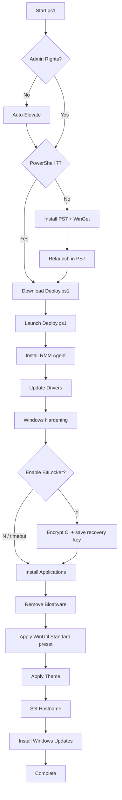

# WinDeploy - Windows Deployment Automation

**Open-source Windows 11 deployment automation toolkit built with PowerShell 7**

[](https://opensource.org/licenses/MIT)
[](https://github.com/PowerShell/PowerShell)
[](https://www.microsoft.com/windows)

[](https://github.com/THectic-NL/WinDeploy/actions/workflows/security.yml)
[](https://github.com/THectic-NL/WinDeploy/actions/workflows/validate.yml)
[](https://github.com/THectic-NL/WinDeploy/actions/workflows/codeql.yml)
[](https://github.com/THectic-NL/WinDeploy/actions/workflows/dependabot/dependabot-updates)

Zero-touch Windows deployment with automatic driver updates, application installation, bloatware removal, and system configuration. Deploy via USB, network, RMM agents, or AutoUnattend.xml.

## Deployment options

| Local USB / AutoUnattend.xml | Intune / Autopilot |
|---|---|
| Deploy locally via USB, [`autounattend.xml`](Docs/autounattend.xml), or [one-liner script](#quick-start). | Deploy via [Intune Autopilot](Docs/Intune-Autopilot-Setup.md), targeting specific user groups. |
| [](#quick-start) | [](Docs/Intune-Autopilot-Setup.md) |

<details open>
<summary>View deployment screenshots</summary>

<br>

| Deployment Start | Successful Completion |
|-----------------|----------------------|
|  |  |

</details>

---

## Quick Start

**Prerequisites:** Windows 11 Pro 25H2+, PowerShell 7, internet connection

### Option 1: USB Deployment (Fresh installs)
1. Create bootable Windows 11 USB
2. Copy `autounattend.xml` to USB root
3. (Optional) Copy RMM agent as `Agent.exe` to USB root
4. Boot from USB with network connected. Keep USB connected until deployment completes.
5. Wait. Everything happens automatically.

### Option 2: Direct Execution
```powershell
# Run as Administrator in PowerShell 7
iex (irm "https://raw.githubusercontent.com/THectic-NL/WinDeploy/$((irm https://api.github.com/repos/THectic-NL/WinDeploy/releases/latest).tag_name)/Scripts/Start.ps1")
```

---

## How It Works



`Start.ps1` ensures PowerShell 7 and WinGet are available, handles elevation, and downloads `Deploy.ps1`. `Deploy.ps1` orchestrates the deployment by downloading and executing each script in sequence.

### Interactive steps

BitLocker (in `Harden-Windows.ps1`) asks Y/N before running; it times out after 90 seconds and defaults to **No**, so an unattended run never stalls. The WinUtil tweaks (`Apply-Tweaks.ps1`) run automatically with the `Standard` preset - pass `-Tweaks No` to skip them, or `-Tweaks Ask` to be prompted instead. Everything else is applied automatically.

```powershell
.\Deploy.ps1 -NonInteractive              # no prompts; BitLocker skipped, WinUtil Standard preset still runs
.\Deploy.ps1 -BitLocker Yes -Tweaks No    # no prompts; BitLocker applied, WinUtil skipped
```

The `autounattend.xml` USB deployment passes `-NonInteractive` automatically, so it also gets the WinUtil `Standard` preset unattended.

---

## Configuration

### Customize Application List
Edit [`Scripts/Deployment/Install-Applications.ps1`](Scripts/Deployment/Install-Applications.ps1) (lines 20-30):
```powershell
$Applications = @(
    "Microsoft.VCRedist.2015+.x64",
    "Microsoft.Office",
    "Microsoft.Teams",
    # Add your apps here
)
```

### Customize Bloatware List
Edit [`Scripts/Deployment/Remove-Bloat.ps1`](Scripts/Deployment/Remove-Bloat.ps1) (lines 15-40):
```powershell
$BloatwareList = @(
    "Microsoft.BingNews",
    "Microsoft.GamingApp",
    # Add packages to remove
)
```

### Configure RMM Agent Installation
Place your agent installer as `Agent.exe` (or any `*agent*.exe`) on the USB drive root. The script detects and installs it silently during deployment. Works with any RMM solution that supports silent installation (e.g., `/S` switch).

### Supported Devices (Drivers & Firmware)
- **Dell**: Latitude, OptiPlex, Precision, XPS series
- **HP**: EliteBook, ProBook, EliteDesk, ProDesk, ZBook series

---

## Security hardening

`Harden-Windows.ps1` applies these automatically:

| Area | Setting |
|---|---|
| Removable media | AutoRun disabled, `autorun.inf` blocked |
| SMB | SMBv1 feature removed, client + server signing required, insecure guest logons blocked |
| Credentials | LSA protection (RunAsPPL), WDigest plaintext caching off, anonymous SAM/share enumeration restricted |
| Network | LLMNR disabled |
| Code integrity | Memory integrity (HVCI) enabled |
| Defender | 9 Attack Surface Reduction rules enabled |
| Other | Device co-installers disabled, Windows Script Host disabled |
| Screen lock | Secure screen saver after 15 minutes, console lock on resume |

Memory integrity, LSA protection and SMB signing require a restart. Windows Script Host is disabled; a few legacy MSI installers use VBScript custom actions and can fail because of it.

### BitLocker

Opt-in, asks Y/N. On yes: `C:` is encrypted with XTS-AES-256 (used space only, TPM-bound), a recovery password is created, written to your Documents folder and printed on screen.

**Store that key elsewhere and delete the file.** Without it the drive cannot be recovered after a TPM clear, mainboard swap or firmware change.

```powershell
.\Harden-Windows.ps1 -BitLocker Yes   # encrypt without prompting
.\Harden-Windows.ps1 -BitLocker No    # skip BitLocker, apply the rest
```

---

## WinUtil tweaks

`Apply-Tweaks.ps1` runs a [WinUtil](https://github.com/ChrisTitusTech/winutil) preset in its own process, by default with no prompt. Standard creates a restore point, then disables activity history, location, telemetry, consumer features, Delivery Optimization and Explorer folder-type auto-discovery, sets non-essential services to manual, and cleans temp files.

```powershell
.\Apply-Tweaks.ps1                     # Standard preset, no prompt (default)
.\Apply-Tweaks.ps1 -Tweaks No          # skip it
.\Apply-Tweaks.ps1 -Tweaks Ask         # ask Y/N instead
.\Apply-Tweaks.ps1 -Preset Minimal
.\Apply-Tweaks.ps1 -Preset Advanced    # also removes OneDrive, widgets, Windows AI
```

---

## Logging

All operations are logged to `C:\WinDeploy\Logs\`:
- `Start.log`. Main entry point log.
- `Install-Drivers.log`, `Install-Applications.log`, `Harden-Windows.log`, `Apply-Tweaks.log`, etc. Per-script logs.

View logs in real-time:
```powershell
Get-Content "C:\WinDeploy\Logs\Start.log" -Wait -Tail 20
```

---

## Dependencies

WinDeploy automatically installs and manages all dependencies:

| Dependency | Source | Purpose |
|---|---|---|
| [winget-install](https://www.powershellgallery.com/packages/winget-install) | PowerShell Gallery | Reliable WinGet installation by [asheroto](https://github.com/asheroto/winget-install) |
| [PSWindowsUpdate](https://www.powershellgallery.com/packages/PSWindowsUpdate) | PowerShell Gallery | Windows Update automation |
| [Dell Command Update](https://www.dell.com/support/kbdoc/en-us/000177325/dell-command-update) | WinGet | Dell driver management |
| [HP Image Assistant](https://ftp.hp.com/pub/caps-softpaq/cmit/HPIA.html) | WinGet | HP driver management |

---

## Troubleshooting

**Script blocked by execution policy**
```powershell
Set-ExecutionPolicy Bypass -Scope Process
```

**Windows Spotlight not working after deployment**
```powershell
# Run as Administrator
& "C:\WinDeploy\Download\Fix-Spotlight.ps1"
```
Then set lock screen to "Windows Spotlight" in Settings > Personalization > Lock screen.

**WinGet not found**
```powershell
# Run as Administrator
Install-Script winget-install -Force
winget-install
```

**Drivers not installing**
- Confirm internet connection
- Check device is a supported Dell or HP model
- Review `C:\WinDeploy\Logs\Install-Drivers.log`

**Applications failing to install**
- Run `winget --version` to verify WinGet works
- Use `winget search <app-name>` to verify the correct package ID
- Check `C:\WinDeploy\Logs\Install-Applications.log`
- If default ID fails, try the `msstore` source version:
  1. Run `winget search <app-name>`
  2. Find entries with `Source: msstore`
  3. Or find the App ID at [apps.microsoft.com](https://apps.microsoft.com)


---

## Credits

- [PowerShell](https://github.com/PowerShell/PowerShell)
- [WinGet](https://github.com/microsoft/winget-cli)
- [PSWindowsUpdate](https://www.powershellgallery.com/packages/PSWindowsUpdate)
- [winget-install](https://www.powershellgallery.com/packages/winget-install) by [asheroto](https://github.com/asheroto/winget-install)
- [Dell Command Update](https://www.dell.com/support/kbdoc/en-us/000177325/dell-command-update)
- [HP Image Assistant](https://ftp.hp.com/pub/caps-softpaq/cmit/HPIA.html) / [HP CMSL](https://developers.hp.com/hp-client-management/doc/client-management-script-library)

## Contributing & Support

Contributions welcome. See [CONTRIBUTING.md](CONTRIBUTING.md).

- **Issues**: [GitHub Issues](https://github.com/THectic-NL/WinDeploy/issues)
- **Discussions**: [GitHub Discussions](https://github.com/THectic-NL/WinDeploy/discussions)

## Disclaimer

Provided "as is" without warranty. Test in a safe environment before production use.

---
